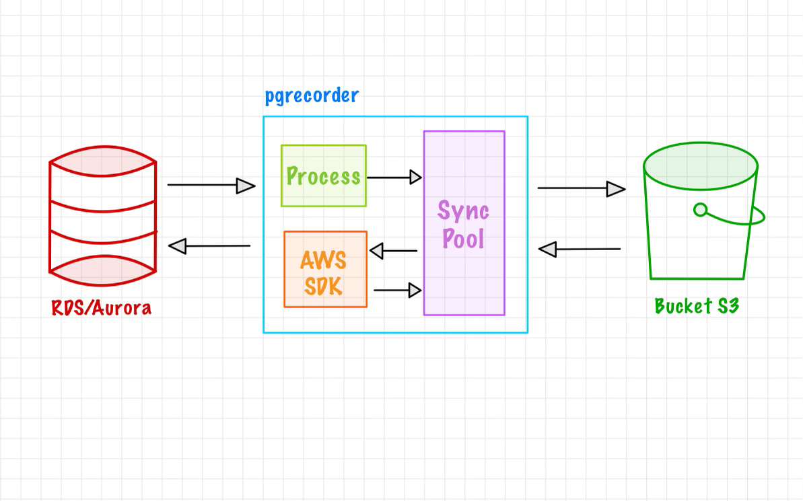
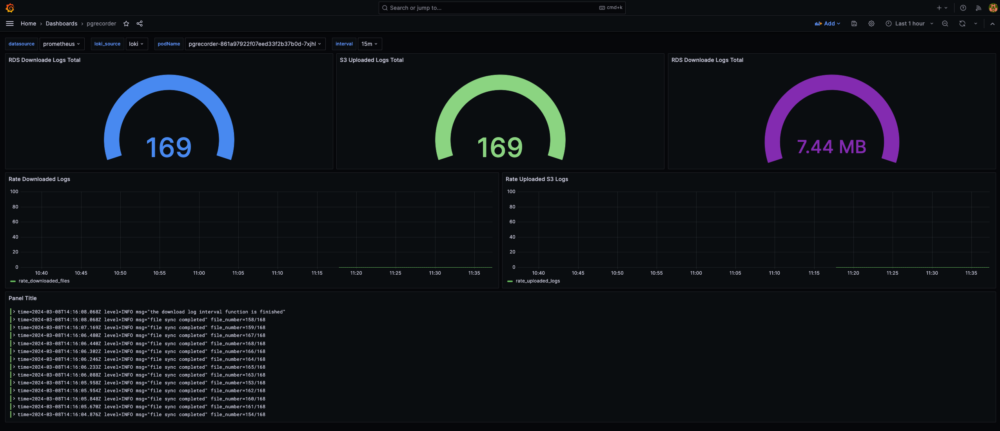

# rdsrecorder
This is a log management tool for *RDS/Aurora* databases running the **PostgreSQL** engine. Because AWS self-managed services only allow retention of database logs for a limited time (currently up to 7 days), this tool was created to persist these files in an S3 bucket. With rdsrecorder, you'll be able to capture logs in real-time, synchronize previous logs you may have, and take snapshots of your PostgreSQL databases.

## Requirements
To use this tool, you will need the following components:
- An AWS account
    - S3 Bucket: This resource will store all log files.
    - Roles and Permissions:
        - Here are the required permissions:
            ``` json
            "s3": [
                "s3:ListBucket",
                "s3:PutObject",
                "s3:GetObject",
                "s3:DeleteObject",
                "s3:ListAllMyBuckets"
            ]
            "rds": [
                "rds:Describe*",
                "rds:CreateDBSnapshot",
                "rds:CreateDBClusterSnapshot",
                "rds:AddTagsToResource",
                "rds:DownloadDBLogFilePortion"
            ]
            ```
    - Target Database: This is the database for which you want to persist the log files.
- A dedicated compute resource with at least 1 CPU and 2 GB of RAM (this will depend on the quantity and size of the log files you have).

## Design & Functionality


As you can see in the diagram, rdsrecorder connects to the AWS API and downloads logs from this database. For these logs to be downloadable, the file format must be .csv. This is because the tool by default looks for these types of files (if you wish to add compatibility with any other format, you can open a PR 📥).

Once the logs are downloaded, the tool proceeds to upload the files to the bucket. This bucket contains a structure that works as follows:
- rdsrecorder generates a PID (process ID)
    - This PID is used to create a folder in the main directory of the bucket.
    - The files will have the following format: `"rds_log_%s_%d", ProcessID, dateFile.Unix() -> "rds_log_BKNDLFUKCAHP_1697493600"`
        - dateFile corresponds to the date that the log file contains, for example: `"error/postgresql.log.2024-03-04-19.csv" -> "2024-03-04-19:00"`

## Actions
As mentioned earlier, rdsrecorder can perform 2 actions:
- Capture logs:
    - Synchronization Types:
        - `Wait & Sync`: This means that the start recording date is in the future, so the tool will wait and synchronize with the database in order to download logs that do not yet exist.
            - Takes an snapshot: ✅
        - `Download the interval & Finish`: This indicates that the end date is in the past, so it will download all logs within the time interval.
            - Takes an snapshot: ❌
        - `Download the interval & Sync`: This type of synchronization is a mixture of the previous two. This means that the start date is in the past, but the end date is in the future, so it must download all logs and synchronize with the database to obtain future logs.
            - Takes an snapshot: ❌
- Perform Snapshots: For this to work, the start date to take the snapshot must be in the future, because if there is any delay when executing the tool, the backup process cannot be executed.
### Examples
``` bash
rdsrecorder sync \
--start="2024-02-04 13:00:00.000 UTC" \
--finish="2024-02-04 14:00:00.000 UTC" \
--bucket my-test-bucket \
--db-identifier my-test-db
```
```
rdsrecorder snapshot \
--start="2024-02-04 13:00:00.000 UTC" \
--db-identifier my-test-db
```
If you want more information about the commands and parameters, run the binary without any arguments.

## Monitoring
Currently, rdsrecorder exposes some metrics that you can use Prometheus and Grafana to visualize. You can find the pre-built dashboard at: [grafana/dashborad.json](grafana/dashborad.json).


